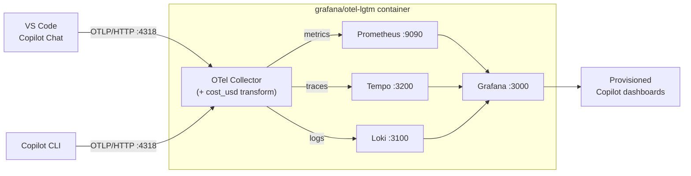
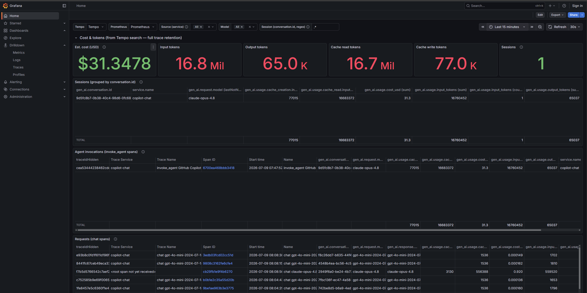

# GitHub Copilot telemetry on Grafana LGTM

Grafana dashboards for GitHub Copilot agent telemetry, running on the
[`grafana/otel-lgtm`](https://github.com/grafana/docker-otel-lgtm) all-in-one
OpenTelemetry backend (Loki, Grafana, Tempo, Mimir/Prometheus, plus an
OpenTelemetry Collector).

Both Copilot surfaces can emit OpenTelemetry traces, metrics, and events for
agent interactions, LLM calls, tool executions, and token usage:

- **VS Code Copilot Chat** (service name `copilot-chat`) — configured via VS Code
  settings.
- **GitHub Copilot CLI** (service name `github-copilot`) — configured via
  environment variables (a source-able script is included).

This repo wires that telemetry into a local LGTM container and provisions
ready-made dashboards for both.

## How it works



The collector is configured ([otelcol/otelcol-config.yaml](otelcol/otelcol-config.yaml))
to project an estimated USD cost (`gen_ai.usage.cost_usd`) onto every span that
carries token usage, so cost is available to any panel without per-dashboard math.

## Prerequisites

- Docker with Compose v2 (`docker compose`)
- VS Code with GitHub Copilot Chat, and/or the GitHub Copilot CLI (`copilot`)

## Quick start

1. Start the LGTM stack:

   ```bash
   docker compose up -d
   ```

2. Enable Copilot telemetry export for the surface(s) you use:

   - **VS Code Copilot Chat** — the `github.copilot.chat.otel.*` settings are
     *application-scoped*, so they only take effect in your **User** settings
     (VS Code ignores them, with a warning, in a workspace
     `.vscode/settings.json`). Open the Command Palette and run
     **Preferences: Open User Settings (JSON)**, then merge in the keys from
     [examples/vscode-user-settings.jsonc](examples/vscode-user-settings.jsonc):

     ```json
     {
       "github.copilot.chat.otel.enabled": true,
       "github.copilot.chat.otel.exporterType": "otlp-http",
       "github.copilot.chat.otel.otlpEndpoint": "http://localhost:4318"
     }
     ```

   - **GitHub Copilot CLI** — source the env script before running `copilot`
     (see [GitHub Copilot CLI](#github-copilot-cli) below):

     ```bash
     source scripts/copilot-cli-otel.sh
     ```

3. Use Copilot Chat / agent mode (or the CLI) to generate some activity.

4. Open Grafana at <http://localhost:3000> (default login `admin` / `admin`).
   The **GitHub Copilot** dashboard folder contains the provisioned dashboards,
   and the overview dashboard is set as the home dashboard.

To stop the stack:

```bash
docker compose down          # keep collected data
docker compose down -v       # also delete the persisted data volume
```

## Enabling telemetry with environment variables

Instead of (or in addition to) VS Code settings, you can enable export with
environment variables, which take precedence:

```bash
export COPILOT_OTEL_ENABLED=true
export OTEL_EXPORTER_OTLP_ENDPOINT=http://localhost:4318
# Optional: tag telemetry so you can filter by team/dept in Grafana
export OTEL_RESOURCE_ATTRIBUTES="team.id=platform,department=engineering"
```

To capture full prompt/response/tool content into spans (visible in Tempo), set
`github.copilot.chat.otel.captureContent` to `true` or
`COPILOT_OTEL_CAPTURE_CONTENT=true`. This can include source code and sensitive
data — only enable it in a trusted local environment.

## GitHub Copilot CLI

The Copilot CLI is a separate surface from the VS Code extension. It reads its
OpenTelemetry configuration from environment variables (there is no
settings.json equivalent), so this repo ships a source-able script:

```bash
# Route CLI telemetry to the local LGTM stack for the current shell.
source scripts/copilot-cli-otel.sh

# Also capture prompts and responses (into trace span attributes).
COPILOT_CAPTURE_CONTENT=1 source scripts/copilot-cli-otel.sh

# Then run the CLI in the same shell.
copilot
```

On Windows PowerShell, dot-source the equivalent script:

```powershell
. .\scripts\copilot-cli-otel.ps1                 # enable telemetry
. .\scripts\copilot-cli-otel.ps1 -CaptureContent # also capture prompts/responses
```

The script sets the variables documented in the
[Copilot CLI OpenTelemetry reference](https://docs.github.com/en/copilot/reference/copilot-cli-reference/cli-command-reference#opentelemetry-monitoring):

| Variable | Value set by the script | Purpose |
|----------|-------------------------|---------|
| `OTEL_EXPORTER_OTLP_ENDPOINT` | `http://localhost:4318` | LGTM collector; also enables OTel |
| `OTEL_EXPORTER_OTLP_PROTOCOL` | `http/protobuf` | CLI supports HTTP only (no gRPC) |
| `OTEL_SERVICE_NAME` | `github-copilot` | Identifies CLI telemetry |
| `OTEL_INSTRUMENTATION_GENAI_CAPTURE_MESSAGE_CONTENT` | `false` (opt-in) | Capture prompts/responses |

How the CLI differs from the VS Code extension:

- **Service name** is `github-copilot` (the extension is `copilot-chat`), which
  becomes the Prometheus `job` label and the Tempo `service.name`.
- **Content capture** uses `OTEL_INSTRUMENTATION_GENAI_CAPTURE_MESSAGE_CONTENT`,
  not `COPILOT_OTEL_CAPTURE_CONTENT`.
- **Vendor metrics** use the `github.copilot.*` namespace (for example
  `github.copilot.tool.call.count`) instead of `copilot_chat.*`. Shared
  `gen_ai.*` metrics (token usage, operation duration) are emitted by both.
- **Prompts and responses** land as span attributes (`gen_ai.input.messages` /
  `gen_ai.output.messages`) on the `invoke_agent` and `chat` traces in Tempo —
  not in logs. Explore them in Grafana with the Tempo data source, filtering by
  `service.name = github-copilot`.

## Dashboards

| Dashboard | File | Source | Surface | Highlights |
|-----------|------|--------|---------|------------|
| GitHub Copilot - Overview | [copilot-overview.json](grafana/dashboards/copilot-overview.json) | Metrics (Prometheus) | Shared + VS Code | Sessions, input/output tokens, token rate by model, LLM call duration, time to first token, tool calls. Has a **Source (service)** filter to isolate VS Code vs CLI |
| GitHub Copilot - Tools & Agent Activity | [copilot-tools-activity.json](grafana/dashboards/copilot-tools-activity.json) | Metrics (Prometheus) | VS Code extension | Tool call counts and latency, edit accept/reject decisions, lines of code changed, agent invocation duration |
| GitHub Copilot - Cost & Sessions | [copilot-cost-sessions.json](grafana/dashboards/copilot-cost-sessions.json) | Spans (Tempo) | Both (CLI + VS Code) | **Home dashboard.** Estimated USD cost + tokens up top, then Sessions / Agent invocations / Requests tables (tokens, cache, `cost_usd`), with **Source**, **Model**, and **Session** filters |

Both metric surfaces share the same `gen_ai.*` token and duration metrics, so the
Overview dashboard covers VS Code and the CLI together; its **Source (service)**
filter isolates `copilot-chat` (VS Code) from `github-copilot` (CLI). A dedicated
CLI dashboard is no longer needed — the shared metrics plus the source filter,
together with the span-based Cost & Sessions dashboard, cover the CLI.

### Cost & Sessions (span-based, the home dashboard)

This is the default/home dashboard and leads with **estimated USD cost and
tokens**. Cost, cache tokens, and per-session detail live only on trace spans
(not metrics), so the dashboard reads them from Tempo:

- The **Session** variable filters by `gen_ai.conversation.id` (regex; copy an id
  from the table). **Source** and **Model** filter by service and model.
- The telemetry is hierarchical: a **session** (`gen_ai.conversation.id`) contains
  one or more **agent invocations** (`invoke_agent` spans, one per user message),
  each of which makes several **requests** (`chat` spans, one LLM call each). The
  dashboard mirrors this with three tables — **Sessions** (grouped by
  `conversation.id`, totals per session), **Agent invocations** (one row per
  `invoke_agent` span), and **Requests** (one row per `chat` span) — plus stat
  cards for cost, tokens, cache, and sessions. Everything is computed from **Tempo
  Search** (full trace retention), so it stays populated as long as traces exist.
- Span names include a model suffix (for example `chat claude-opus-4.8`), so the
  queries match by regex (`name =~ "chat.*"` / `name =~ "invoke_agent.*"`) to
  catch both surfaces. Per-request input tokens overlap (context is re-sent each
  turn), so trust the invocation-level totals rather than summing requests.

#### Estimated cost

Cost is shown as **`gen_ai.usage.cost_usd`**, computed at ingest by the OTel
Collector — not by the dashboard. The collector's transform
([otelcol/otelcol-config.yaml](otelcol/otelcol-config.yaml)) applies, per span:

```text
billed_input = max(0, input_tokens - cache_read - cache_creation)
cost_usd = (billed_input   * rate_in
          + output_tokens  * rate_out
          + cache_read     * rate_cache_read
          + cache_creation * rate_cache_write) / 1e6
```

Rates are **USD per 1,000,000 tokens**, matched per model (with a `default`
fallback). This mirrors the approach of the
[Aspire CopilotCost extension](https://github.com/cicorias/copilot-cost-dashshboard-aspire/tree/main/extension/CopilotCost).
The rates in the config are **illustrative list prices — edit them** to match
your plan, then restart the container (`docker compose restart lgtm`).

> The provider does emit a raw `github.copilot.cost` (CLI only, unit-opaque, not
> USD) and `github.copilot.nano_aiu` (÷1e9 = the CLI's "AI credits"), but the
> dashboard uses the collector-computed USD estimate instead.

#### Cost as a Prometheus metric

The collector also runs a **`sum` connector** that projects the per-span cost and
AI-unit attributes into Prometheus metrics, so cost is available to *any*
dashboard with full retention (not just Tempo Search):

| Metric | Meaning | Labels |
|--------|---------|--------|
| `copilot_cost_usd_total` | Summed `gen_ai.usage.cost_usd` over `invoke_agent` spans | `gen_ai_request_model`, `job` (source) |
| `copilot_nano_aiu_total` | Summed `github.copilot.nano_aiu` (÷1e9 = AI credits) | `gen_ai_request_model`, `job` (source) |

For example, cost added per interval by model:
`sum by (gen_ai_request_model) (increase(copilot_cost_usd_total[$__rate_interval]))`.
Because these are metrics, they work on the Overview dashboard too and are not
subject to Tempo's span/metrics retention limits.

> Two caveats: (1) cost (`cost_usd` on spans and the `copilot_*_total` metrics)
> is only produced for telemetry **ingested after** the collector was configured
> — historical data shows blank cost until new activity flows. (2) The Cost &
> Sessions *tables* are Search-based (not TraceQL *metrics*), because this image's
> TraceQL metrics only retain a short recent window; Search keeps the per-session
> tables populated when a session goes idle.

Traces (the `invoke_agent` -> `chat` -> `execute_tool` span tree) are stored in
Tempo. Open **Explore** in Grafana, select the Tempo data source, and filter by
`service.name = copilot-chat` (VS Code) or `service.name = github-copilot` (CLI)
to inspect individual agent runs.

## Metric naming note

The Copilot SDK emits OpenTelemetry metrics such as `gen_ai.client.token.usage`
and `copilot_chat.tool.call.count`. The LGTM container forwards these to
Prometheus, which normalizes the names: dots become underscores, counters gain a
`_total` suffix, histograms expand into `_bucket` / `_sum` / `_count`, and unit
suffixes (for example `_seconds`, `_milliseconds`) are appended. The provisioned
dashboards use these normalized names, for example:

| OpenTelemetry instrument | Prometheus series used in dashboards |
|--------------------------|--------------------------------------|
| `gen_ai.client.token.usage` | `gen_ai_client_token_usage_sum`, `_count`, `_bucket` |
| `gen_ai.client.operation.duration` | `gen_ai_client_operation_duration_bucket` (VS Code) / `gen_ai_client_operation_duration_seconds_bucket` (CLI) |
| `copilot_chat.session.count` | `copilot_chat_session_count_total` |
| `copilot_chat.tool.call.count` | `copilot_chat_tool_call_count_total` |
| `copilot_chat.tool.call.duration` | `copilot_chat_tool_call_duration_bucket` (values in ms) |
| `copilot_chat.time_to_first_token` | `copilot_chat_time_to_first_token_bucket` |
| `copilot_chat.agent.invocation.duration` | `copilot_chat_agent_invocation_duration_bucket` |
| `github.copilot.tool.call.count` (CLI) | `github_copilot_tool_call_count_total` |
| `github.copilot.tool.call.duration` (CLI) | `github_copilot_tool_call_duration_seconds_bucket` |
| `gen_ai.client.operation.time_to_first_chunk` (CLI) | `gen_ai_client_operation_time_to_first_chunk_seconds_bucket` |

Whether Prometheus appends a unit suffix (for example `_seconds`) depends on the
unit metadata the emitter attaches. The VS Code extension's `copilot_chat.*`
duration histograms arrive without a unit suffix, while the CLI's `gen_ai.*`
durations arrive as `_seconds`. If a panel shows "No data", confirm the real
names in Grafana **Explore** with the Prometheus data source (use the metrics
browser, or query `{__name__=~"copilot.*|gen_ai.*"}`), then adjust the query.

## Add your own dashboards

Drop any Grafana dashboard JSON file into
[grafana/dashboards/](grafana/dashboards/) and restart the container:

```bash
docker compose restart lgtm
```

The provisioning provider in
[grafana/provisioning/dashboards/copilot.yaml](grafana/provisioning/dashboards/copilot.yaml)
auto-loads every JSON in that folder into the **GitHub Copilot** folder. Each
dashboard needs a unique `uid` and `title`. Reference Prometheus via the
`datasource` template variable (type `datasource`, query `prometheus`) so the
dashboard works regardless of the data source UID.

## Ports

| Port | Service | Notes |
|------|---------|-------|
| 3000 | Grafana | UI, `admin` / `admin` |
| 4317 | OTLP/gRPC | Telemetry ingest |
| 4318 | OTLP/HTTP | Telemetry ingest (Copilot default) |
| 9090 | Prometheus | Metrics, optional |
| 3200 | Tempo | Traces, optional |

## Screenshots



## References

- [Monitor agent usage with OpenTelemetry](https://code.visualstudio.com/docs/agents/guides/monitoring-agents)
- [grafana/docker-otel-lgtm](https://github.com/grafana/docker-otel-lgtm)
