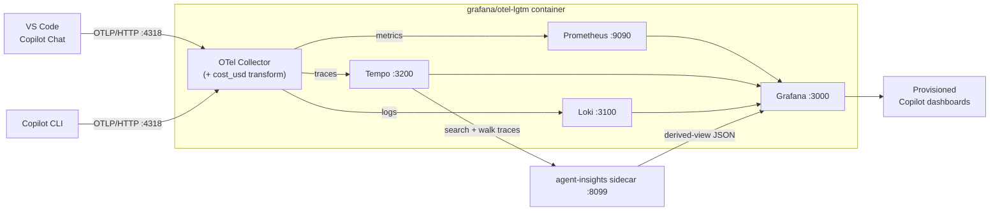
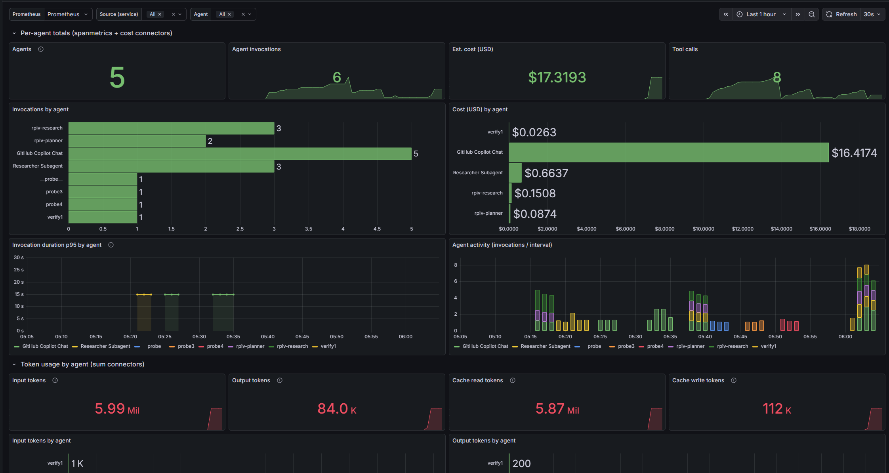

# GitHub Copilot telemetry on Grafana LGTM

Grafana dashboards for GitHub Copilot agent telemetry, running on the
[`grafana/otel-lgtm`](https://github.com/grafana/docker-otel-lgtm) all-in-one
OpenTelemetry backend (Loki, Grafana, Tempo, Mimir/Prometheus, plus an
OpenTelemetry Collector).

Both Copilot surfaces can emit OpenTelemetry traces, metrics, and events for
agent interactions, LLM calls, tool executions, and token usage:

- **VS Code Copilot Chat** (service name `copilot-chat`) — configured via VS Code
  settings.
- **GitHub Copilot CLI** (service name `github-copilot`) — configured via
  environment variables (a source-able script is included).

This repo wires that telemetry into a local LGTM container and provisions
ready-made dashboards for both.

## How it works



The collector ([otelcol/otelcol-config.yaml](otelcol/otelcol-config.yaml))
projects an estimated USD cost onto every span that carries token usage, so cost
is available to any panel without per-dashboard math. See
[docs/cost-and-metrics.md](docs/cost-and-metrics.md) for the model. The
[agent-insights](agent-insights/) sidecar walks Tempo traces to build the agent
topology, per-conversation summaries, per-agent timelines, per-repo/branch cost,
and cost distributions for the Agent Graph, Agent Timeline, Cost by Repo &
Branch, and Cost Distribution by Agent dashboards.

## Prerequisites

- Docker with Compose v2 (`docker compose`)
- VS Code with GitHub Copilot Chat, and/or the GitHub Copilot CLI (`copilot`)

## Quick start

### Scripted install (`curl | bash`)

If you would rather not clone the repo, the bootstrap script downloads the
assets, optionally starts the stack, and wires up telemetry interactively:

```bash
curl -fsSL https://raw.githubusercontent.com/dasiths/github_copilot_grafana_extensions/main/scripts/install.sh | bash
```

On Windows, use the PowerShell installer instead:

```powershell
irm https://raw.githubusercontent.com/dasiths/github_copilot_grafana_extensions/main/scripts/install.ps1 | iex
```

It fetches the compose file, Grafana provisioning, collector config, and the
agent-insights sidecar into `~/.agents/telemetry/copilot-extensions/`, prints the
VS Code User settings for you to paste, and can add the Copilot CLI `source` line
to your shell profile. It prompts at each step (even through the pipe) and skips
anything it cannot do; re-run it with `--uninstall` to reverse the changes. The
manual steps below do the same thing if you prefer to run them yourself.

### Manual setup

1. Start the LGTM stack:

   ```bash
   docker compose up -d
   ```

2. Enable Copilot telemetry export for the surface(s) you use. Full instructions
   are in [docs/telemetry.md](docs/telemetry.md); the short version:

   - **VS Code Copilot Chat** — add these to your **User** `settings.json` (these
     settings are application-scoped and ignored in a workspace file):

     ```json
     {
       "github.copilot.chat.otel.enabled": true,
       "github.copilot.chat.otel.exporterType": "otlp-http",
       "github.copilot.chat.otel.otlpEndpoint": "http://localhost:4318"
     }
     ```

   - **GitHub Copilot CLI** — source the env script before running `copilot`:

     ```bash
     source scripts/copilot-cli-otel.sh
     ```

3. Use Copilot Chat / agent mode (or the CLI) to generate some activity.

4. Open Grafana at <http://localhost:3000> (default login `admin` / `admin`).
   The **GitHub Copilot** dashboard folder contains the provisioned dashboards,
   Overview is the home dashboard, and a **Dashboards** dropdown in the top bar
   switches between them.

To stop the stack:

```bash
docker compose down          # keep collected data
docker compose down -v       # also delete the persisted data volume
```

## Dashboards

| Dashboard | Source | Surface |
|-----------|--------|---------|
| [Overview](grafana/dashboards/copilot-overview.json) (home) | Metrics (Prometheus) | Both |
| [Cost & Sessions](grafana/dashboards/copilot-cost-sessions.json) | Spans (Tempo) | Both |
| [Tools & Agent Activity](grafana/dashboards/copilot-tools-activity.json) | Metrics (Prometheus) | VS Code (+ CLI tool calls) |
| [Agents](grafana/dashboards/copilot-agents.json) | Metrics (Prometheus) | Both |
| [Agent Graph](grafana/dashboards/copilot-agent-graph.json) | Traces via `agent-insights` sidecar (Infinity) | Both |
| [Agent Timeline](grafana/dashboards/copilot-agent-timeline.json) | Traces via `agent-insights` sidecar (Infinity) | Both |
| [Cost by Repo & Branch](grafana/dashboards/copilot-branches.json) | Traces via `agent-insights` sidecar (Infinity) | Both |
| [Cost Distribution by Agent](grafana/dashboards/copilot-cost-distribution.json) | Traces via `agent-insights` sidecar (Infinity) | Both |

See [docs/dashboards.md](docs/dashboards.md) for what each dashboard shows, the
Cost & Sessions data model, metric naming, and how to add your own.

## Documentation

- [docs/telemetry.md](docs/telemetry.md) — enabling telemetry for VS Code and the
  CLI, environment variables, and capturing prompt/response content.
- [docs/cost-and-metrics.md](docs/cost-and-metrics.md) — the estimated cost model
  and the Prometheus metrics the collector produces.
- [docs/dashboards.md](docs/dashboards.md) — dashboard details, metric naming, and
  adding your own dashboards.

## Ports

| Port | Service | Notes |
|------|---------|-------|
| 3000 | Grafana | UI, `admin` / `admin` |
| 4317 | OTLP/gRPC | Telemetry ingest |
| 4318 | OTLP/HTTP | Telemetry ingest (Copilot default) |
| 9090 | Prometheus | Metrics, optional |
| 3200 | Tempo | Traces, optional |
| 8099 | agent-insights | Sidecar trace-derived view JSON, optional |

## Screenshots





## References

- [Monitor agent usage with OpenTelemetry](https://code.visualstudio.com/docs/agents/guides/monitoring-agents)
- [grafana/docker-otel-lgtm](https://github.com/grafana/docker-otel-lgtm)
